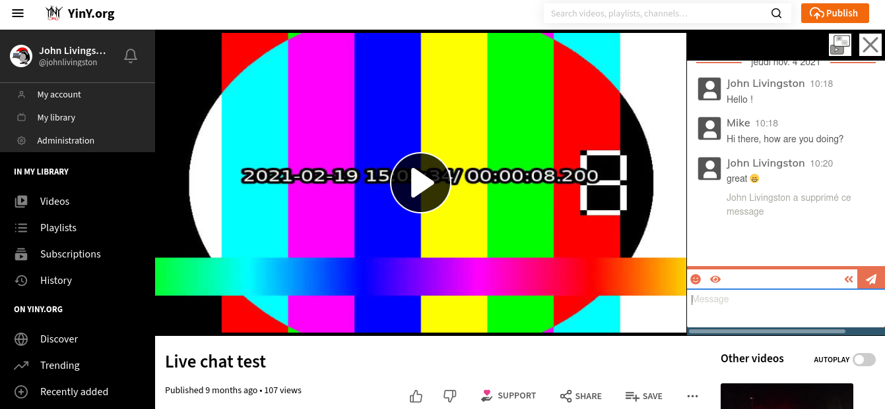

# PeerTube plugin livechat 🇬🇧

🇫🇷 French version / Version française [ici](README.fr.md).

This [Peertube](https://joinpeertube.org/) plugin is meant to provide chat system for Peertube videos.

**IMPORTANT:** unfortunately this plugin does not (yet) work by itself, it must rely on external tools. Please read the [installation guide](documentation/installation.md).

**Before updating to a major release, please read the release notes and breaking changes list : [CHANGELOG](CHANGELOG.md)**.

## Documentation

* [Installation guide](documentation/installation.md)
* [User guide](documentation/user.md)
* [Administrator guide](documentation/admin.md)

## New features requests / Bug tracking

If you have new feature requests, bugs, or difficulties to setup the plugin, you can use the [Github issue tracker](https://github.com/JohnXLivingston/peertube-plugin-livechat/issues).

Here is a roadmap for upcoming features: [ROADMAP](ROADMAP.md).

If you are a webdesigner or a ConverseJS/Prosody/XMPP expert, and want to help improve this plugin, you are welcome.

## Contact me

If you have any question, or if you want to talk about this plugin, you can join this XMPP room with any Jabber client: [plugin-livechat-support@room.im.yiny.org](xmpp:plugin-livechat-support@room.im.yiny.org?join).

If you want to support the project financially, you can contact me by mail at git.[at].john-livingston.fr, or check my [Liberapay profile](https://liberapay.com/JohnLivingston/).

## Contribute

Please refer to [CONTRIBUTING.md](CONTRIBUTING.md).

## Contribute

Please refer to the page [CONTRIBUTING.md](CONTRIBUTING.md).

## Credits

[package.json](package.json), [COPYRIGHT](COPYRIGHT.md) and [LICENSE](LICENSE) files contain the license information for this software and its dependencies.

Thanks to David Revoy for his work on Peertube's mascot, [Sepia](https://www.davidrevoy.com/index.php?tag/peertube).

Thanks to [Framasoft](https://framasoft.org) for making [Peertube](https://joinpeertube.org/) possible, and for the financial support.

Thanks to [ritimo](https://www.ritimo.org/) for the financial support.

Thanks to [Code Lutin](https://www.codelutin.com/) for the financial support.
